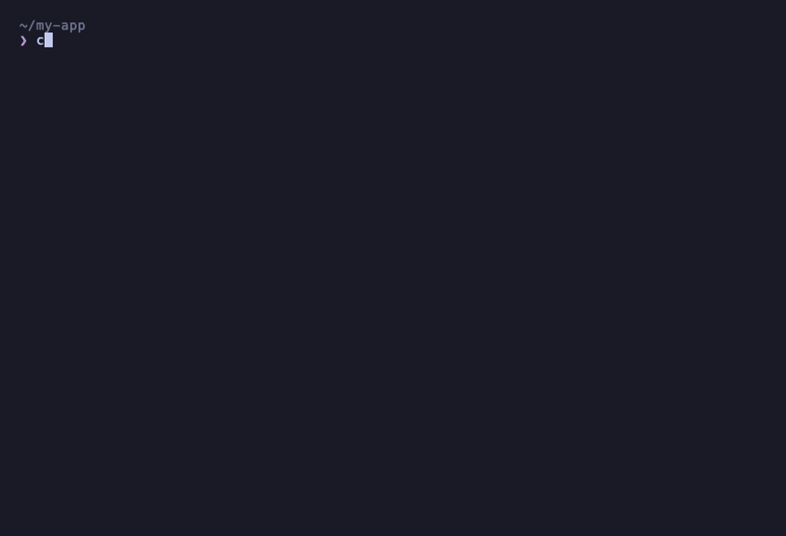

# agentic-security

[](https://github.com/Clear-Capabilities/agentic-security/actions/workflows/ci.yml)
[](./LICENSE)
[]()
[]()


<h3>
Build faster with an<br>
Agentic Workforce.<br>
Safe, secure, and compliant<br>
is now the default.
</h3>

> Built by **[Clear Capabilities](https://www.clearcapabilities.com/)**.

**In one sentence:** agentic-security scans the code your AI agent just wrote (or your whole repo) for security bugs, explains each one in plain English with a dollar-cost estimate instead of a CVE number, and can fix it for you — every fix is re-verified before it ever touches your disk.



**Contents:** [What you get](#what-you-get) · [Install](#install) · [Commands](#commands) · [What makes it different](#what-makes-it-different) · [Fixes are verified, not trusted](#fixes-are-verified-not-trusted) · [Stop overpaying for tokens](#stop-overpaying-for-tokens) · [Language coverage](#language-coverage) · [Compliance frameworks](#compliance-frameworks) · [What this is not](#what-this-is-not)

---

## What you get


```text
─────────────────────────────────────────────────────────────────
  ❌  Not safe to deploy  ·  api-billing
─────────────────────────────────────────────────────────────────
   3 critical · 8 high · 22 medium · 41 advisory
   🔥 2 actively exploited in the wild (CISA KEV)
   ✓  1 CONFIRMED (PoC built by /triage --validate)

   [critical] SQL Injection                api/users.ts:42
     Could leak PII for ~5,000 users.
     Estimated cost if exploited: $125k–$1.3M
     Fix:  use parameterized query — db.query('SELECT * FROM users WHERE id = ?', [id])

   [critical] Hardcoded Stripe live key    src/lib/billing.ts:7
     Could enable fraudulent charges against your account.
     Estimated cost if exploited: $50k–$500k (chargebacks + Stripe fees)
     Fix:  rotate via /agentic-security:fix --rotate-secret --auto, then move to env var

   [critical] Missing webhook signature    api/stripe-webhook.ts:12
     Anyone can POST a fake "payment.succeeded" and unlock paid features.
     Estimated cost if exploited: cost of a free subscription × every attacker
     Fix:  stripe.webhooks.constructEvent(rawBody, signature, endpointSecret)

   How many do you want to fix?
     1. Critical only           (3 fixes)
     2. Critical + High         (11 fixes)
     3. Critical + High + Medium (33 fixes)
─────────────────────────────────────────────────────────────────
```

No CVE jargon. The stakes, the cost, the fix.

---

## Install

**Requirements:** Node.js ≥ 24 (the scanner and hooks run on it either way — Claude Code doesn't provide its own).

In **Claude Code** (recommended) — two steps:

```text
/plugin marketplace add https://github.com/Clear-Capabilities/agentic-security
/plugin install agentic-security@clearcapabilities
```

The first command registers the marketplace as a source; the second actually installs the plugin. Then restart Claude Code (or `/reload-plugins`). To update later: `/plugin marketplace update clearcapabilities` followed by `/plugin install agentic-security@clearcapabilities`.

In your **terminal** (no Claude Code required):

```bash
npx @clear-capabilities/agentic-security-scanner secure .
```

**Want a shareable report?** Any scan can export a self-contained, browser-viewable HTML page (severity charts, STRIDE breakdown, filterable findings) — or JSON / Markdown / SARIF:

```bash
npx @clear-capabilities/agentic-security-scanner scan . --format html --output report.html
# open report.html   (formats: html · json · md · sarif · csv)
```

Also works with Codex, Cursor, and Gemini CLI — [harness setup](docs/HARNESS_COMPATIBILITY.md).

---

## Commands

Not sure where to start? Just run **`/agentic-security:secure`** (also: `--tour`, `--help`, `--daily`) — it looks at your project and tells you what to run next. Everything else is grouped below by what you're trying to do:

**Find and fix problems**
- **`find-and-fix-everything`** — One-shot scan + fix every severity in one command. The "just make it safe" path for **vibecoders** (people building with an AI agent doing most of the typing).
- **`scan`** — Run the scanner. Modes: full / diff / watch / baseline / archaeology / scanner-meta. `--watch` re-scans incrementally on every file change and prints a live risk-delta.
- **`triage`** — Decide on findings. Modes: id / show / explain / validate / tournament / red-team / exploit / query / deep (red/blue/auditor deep-dive on one finding).
- **`fix`** — Remediation. Modes: id / all / pr / sca / compliance / rotate-secret / vault / harden / trim / generate. Every patch — deterministic or agent-composed — is re-verified (rescan-clean + no new ≥medium + lint) before it's written; `--all` runs independent findings in parallel and never halts on the first failure.

**Reporting and audits**
- **`posture`** — Posture + reporting. Modes: status / report-card / harness / trend / threat / playbook / mgmt / cache.
- **`compliance`** — Compliance + auditor flows. Modes: report / walkthrough / attestation / audit / pr.
- **`supply`** — Supply chain. Modes: check / sbom / cve-alerts / license.

**Set up guardrails**
- **`setup`** — Workflow installers + guards. Modes: hooks / ci / predeploy / bodyguard / destructive-guard / model-optimizer. `--ci` generates a multi-provider CI gate; `--predeploy` blocks vercel/fly/wrangler deploys on critical findings.

**Experimental**
- **`labs`** — Experimental + AI-driven. Modes: claude-audit / model-rescan / synthesize-rule / cross-repo / risk-dollars / time-to-fix / llm.

Every command is invoked as `/agentic-security:<name>` (e.g. `/agentic-security:scan`). Every legacy single-purpose alias still works and is redirected to its new mode automatically.

---

## What makes it different

- **Plain-English findings with dollar-cost estimates.** Best/likely/worst-case exposure, grounded in IBM Cost of a Data Breach 2024 and 25+ public settlement records. Not CVE numbers.
- **Intercepts insecure AI-generated code before it hits disk.** The `/setup --bodyguard` hook blocks SQLi via concat, hardcoded API keys, `eval` on user input, and more — in real time, as your AI writes.
- **12-pillar scan in one command.** SAST, SCA, secrets, IaC, LLM safety, MCP agent-tool audit, auth/authZ, pipeline integrity, containers, deploy config, supply chain, and trend tracking.
- **Function-level reachability across every dependency.** OSV ecosystem_specific parsing, GHSA fix-commit analysis, vendored code fingerprinting, Java IR call-graph matching, and LLM-assisted function extraction — not just a hardcoded hints list.
- **SCA reachability tiers.** Every dependency classified as `function-reachable`, `import-reachable`, `build-only`, `manifest-only`, or `transitive-only` — so you fix what matters.
- **CISA KEV + EPSS prioritization.** Separates "this could theoretically be bad" from "people are running scripts that exploit this today."
- **SARIF codeFlows for taint traces.** Multi-step source-to-sink paths rendered natively in GitHub Code Scanning, DefectDojo, and VS Code SARIF Viewer.
- **One-command fix, always verified.** Every patch is previewed, backed up, and revertible — see [Fixes are verified, not trusted](#fixes-are-verified-not-trusted) below.
- **Auto-baseline for legacy codebases.** `--set-baseline` snapshots existing findings; `--since-baseline` shows only what's new. Day-one usable on any project.
- **Refutes its own findings.** A default falsification pass takes each candidate and tries to *disprove* it — looking for the control that would actually block it (a context-matched sanitizer, a dominating guard) and demoting the ones it can. What surfaces is what survived scrutiny. Recall-preserving: nothing is silently dropped.
- **Coverage you can audit.** Enumerates every attacker-reachable entry point — HTTP handlers, queue consumers, cron jobs, CLI args, uploads — and reports the disposition of each, so you can see it looked at your whole attack surface, not just where a finding happened to fire. A confirmed finding then triggers a repo-wide sweep for sibling instances the detectors missed, with honest "N found / M candidate / K mitigated" accounting.
- **Hardens itself against the code it scans.** A tested threat model treats attacker-authored finding text as untrusted input everywhere it reaches an LLM prompt or a rendered PR/issue report — so the tool can't be turned against you by the repo it's auditing.

Deep engine details — [architecture](docs/ARCHITECTURE.md).

---

## Fixes are verified, not trusted

Every patch — whether it's a rule's stored fix, a zero-LLM deterministic swap, or one an agent composed for a finding with no stored fix — goes through the same gate before it touches disk: **rescan-clean, no new ≥medium finding, lint-clean.** If a patch doesn't pass, it isn't written. This is what makes `/find-and-fix-everything` real instead of a to-do list:

- **Deterministic zero-LLM patches** for safe, context-independent classes (weak hash → SHA-256, TLS verification re-enabled) — no model call, no guessing.
- **A verified path for everything else.** A finding with only a template or a plain-English remediation note — the common case — is now fixable: the agent composes the patch, the deterministic verifier proves it safe, then it's applied.
- **Regression tests ship with the fix.** When the scan built a PoC for a finding, the generated test comes along — it fails before the patch and passes after.
- **Parallel, and it doesn't stop at the first flake.** Independent findings fix concurrently; a single failing test doesn't halt the batch — every finding gets a fixed/skipped/refused verdict, and the loop reports its own **acceptance rate**.
- **You can see your security debt aging.** Every scan stamps each finding's age and flags anything past its remediation SLA (critical: 7 days, high: 30, …).
- **Every fix carries an honest completeness tier.** FULL / MITIGATION / WORKAROUND, computed from mechanical signals (did the sink change? are all callers routed through the fix? does a test flip from fail to pass?) — and a residual-risk guard rejects hand-wavy "adequately handled" claims, so a partial fix can never masquerade as a complete one.

---

## Stop overpaying for tokens

Your agentic workforce runs on tokens. agentic-security watches each prompt and tells you when a cheaper model or lower reasoning depth would answer it just as well — and it's the only tool that does this **cache-aware**, accounting for the prompt cache a model switch would throw away.

```text
💡 This simple one-off sits on a deep warm cache (~250k tokens). Switching your
   main model would discard it — instead run this as a Haiku 4.5 subagent: it
   answers in its own context (~84% cheaper) and leaves your Opus 4.8 cache intact.
```

- **Per-prompt model + depth advice, cache-aware.** Suggests the cheapest model + effort that still does the job — you tap `/model` + `/effort`. Prefers a cache-preserving effort drop over a plain model switch, and shows a switch's break-even point ("worth it past ~N more turns"). Zero added tokens; the analysis is purely local.
- **Cache bodyguard.** Warns *before* an edit to `CLAUDE.md` or `.claude/settings` silently invalidates your cache and forces a costly cold re-read.
- **Measured, not guessed.** `/posture --cache` reports what prompt caching actually **saved** and **wasted** this session, in real dollars — plus a running predicted-vs-realized check on the optimizer's own advice.
- **Beyond this session — lints your own AI app's LLM calls too.** Scanning a project that calls Anthropic, OpenAI, Gemini, or xAI? It flags prompt-cache killers and over-provisioned calls, with a fix in that provider's own framework — e.g. an OpenAI app gets "gpt-5.4 at `reasoning_effort: low`."
- **Opt-in: an actual choice, not just a tip.** Set `interactive: true` and a qualifying prompt gets you a real `AskUserQuestion` menu — keep your defaults, get the `/model` command to run yourself, or have Claude apply the cheaper model to its own delegated sub-agent work for the rest of the session. Costs a little real context on the prompts where it fires, unlike everything else in this section.

On by default (advisory only — a hook can't switch your model for you); disable per-project via `/setup --model-optimizer` or the kill switch. Full detail, including the live cost HUD, session budget, and interactive mode — [cache economics](docs/MODEL_COST_OPTIMIZATION.md) · [v2 roadmap](docs/CACHE_ECONOMICS_V2_PRD.md).

---

## Language coverage

Eight first-class languages, with cross-language detectors for the OWASP-relevant injection and crypto-misuse classes.

| Language | Vuln-class coverage |
|----------|---------------------|
| JavaScript / TypeScript | full (flow engine + structural) |
| Python | full (flow engine + structural) |
| Java | full |
| Kotlin | full |
| Go | full |
| Ruby | full |
| PHP | full |
| C# | full |

Detected across these languages: SQL injection, command injection, path traversal, LDAP injection, XPath injection, reflected XSS, SSRF, XXE, code injection (eval / SpEL / Groovy / Roslyn / template), insecure deserialization, hardcoded secrets, weak password hashing, weak ciphers (DES/RC4/Blowfish/ECB), static/zero IV, insecure randomness, CSRF, open redirect, HTTP response splitting, unrestricted file upload, missing authentication on state-changing routes, broken object/function-level authorization (BOLA/BFLA), and ReDoS — plus the JS/Python-specific classes (prototype pollution, mass assignment) and the LLM/agent-tool surface.

The detectors are precision-first: parameterized queries, escaped output, allow-list guards, CSPRNG-derived IVs, framework CSRF middleware, and token-auth schemes are recognized and **not** flagged.

---

## Compliance frameworks

`/compliance --report <framework>` generates an auditor-ready attestation that scans your project against:

| Framework | `<framework>` | Coverage map |
|---|---|---|
| NIST AI 600-1 (2024) — Generative AI Profile | `nist` | [coverage](docs/compliance/nist-ai-600-1-coverage.md) |
| OWASP ASVS 4.0.3 — Application Security Verification Standard | `asvs` | [coverage](docs/compliance/owasp-asvs-coverage.md) |
| OWASP LLM Top 10 (2025) | `llm` | [coverage](docs/compliance/owasp-llm-top10-coverage.md) |
| EU AI Act | `eu-ai-act` | [`scripts/eu-ai-act/`](scripts/eu-ai-act/) |

`/compliance --walkthrough <framework>` adds step-by-step auditor narratives with per-control evidence mapping for `nist-csf-2`, `nist-ai-600-1`, `owasp-asvs-5`, `owasp-llm-top-10`, `eu-ai-act`, `gdpr`, `hipaa-security-rule`, and `ccpa` — or bring your own controls at `.agentic-security/compliance/<id>/controls.json`.

---

## What this is not

- **Not a SaaS dashboard.** It's a CLI + Claude Code plugin.
- **Not a replacement for a pentester.** Static analysis catches patterns; humans catch business-logic flaws. The `security-logic-reviewer` subagent and `/triage --validate` close part of the gap, not all of it.
- **Not magic.** It can miss novel vulnerabilities, especially anything that requires understanding intent.
- **Not free for resale.** PolyForm Internal Use license. Use it to make your own code safe and secure. Don't repackage it as a competing scanner.

---

## License & security

Full legal terms in [LICENSE](./LICENSE). Found a security issue in the tool itself? See [SECURITY.md](./SECURITY.md) for how to report it privately.

---

> Built with care by **[Clear Capabilities](https://www.clearcapabilities.com/)**. Found a bug, have a feature idea, want to talk? Please create a GitHub issue.
