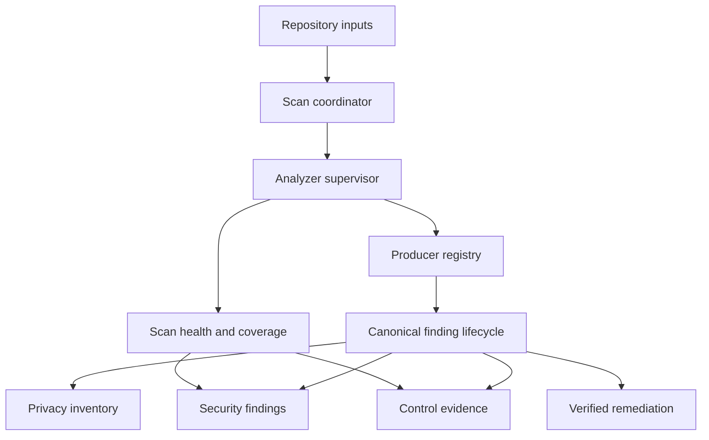

# Product Requirements Document: Agentic Security Assurance Hardening

| Field | Value |
|---|---|
| Product | `agentic-security` |
| PRD status | Proposed for implementation |
| Document version | 1.0 |
| Repository baseline | Commit `248c4cf34e72631bfe9a378c602b9207c61fabc7` |
| Scanner baseline | Version 0.141.0 |
| Primary outcome | Make every security, compliance, privacy, and remediation claim traceable to analysis that demonstrably ran |
| Primary stakeholders | CISO, Compliance Officer, Data Privacy Officer, AppSec, Platform Engineering, Developers |
| Delivery model | P0 assurance core, P1 governance, P2 enterprise scale |
| Product owner | TBD |
| Engineering owner | TBD |

## 1. Executive summary

`agentic-security` already has a broad deterministic security engine, optional model-assisted analysis, evidence and falsification concepts, fix verification, compliance mapping, privacy scaffolding, and extensive output formats. Its primary limitation is no longer detector count. Its limitation is assurance consistency.

The current architecture permits several conditions in which the system can produce a clean-looking or strongly worded result without proving that all relevant analysis completed:

- A detector exception can silently skip every subsequent detector for a file.
- The per-file timeout reports elapsed time after work completes rather than interrupting work.
- Several finding producers run after stable IDs, confidence, proof, falsification, and risk enrichment.
- Async annotators are passed through a synchronous error wrapper.
- Deep analysis is weaker by default in CI than in interactive local use.
- Privacy analysis is invoked with empty declarations and calls.
- Some compliance mappings treat the absence of high or critical findings as satisfaction.
- Some fix paths bypass the strongest verification gate.
- Remote model workflows can transmit large source excerpts without a central data-egress policy.
- Generated state is not governed by a complete retention and deletion registry.
- Default dollar-risk estimates can look more precise than their inputs justify.

This PRD defines the work required to turn the harness from a capable local scanner into an evidence-grade assurance platform. The core design change is a canonical, fail-observable lifecycle shared by every analyzer and every finding.

## 2. Problem statement

Security leaders need to know whether the harness actually completed its analysis, not merely whether it returned findings. Compliance teams need evidence that is scoped, versioned, attributable, and explicit about what was not tested. Privacy teams need demonstrable data-flow analysis and governed treatment of source code, personal data, and generated artifacts. Developers need remediation that cannot write unless the same safety gate approves every change path.

The product currently has strong capabilities in each area, but their guarantees are inconsistent across code paths. This creates four business risks:

1. **False assurance:** an incomplete scan may be interpreted as clean.
2. **Inconsistent remediation safety:** one interface may enforce controls that another bypasses.
3. **Audit overstatement:** technical artifacts may be interpreted as organizational compliance.
4. **Privacy exposure:** source code or derived personal information may be transmitted or retained without a complete policy decision.

### 2.1 Evidence from the current implementation

| ID | Current condition | Business consequence | Source |
|---|---|---|---|
| A-01 | One broad per-file `try` wraps many sequential detectors; the catch records only a timing error | Partial analysis can look complete | [`engine.js` per-file loop](https://github.com/Clear-Capabilities/agentic-security/blob/248c4cf34e72631bfe9a378c602b9207c61fabc7/scanner/src/engine.js#L8292-L8431) |
| A-02 | The timeout is evaluated after all file analysis completes | A hung detector cannot be interrupted | Same source as A-01 |
| A-03 | Cross-language, IAM, container, business-logic, specification, and concurrency findings are appended after canonical enrichment | Findings can lack stable IDs, proof, calibration, and other required fields | [`engine.js` late producers](https://github.com/Clear-Capabilities/agentic-security/blob/248c4cf34e72631bfe9a378c602b9207c61fabc7/scanner/src/engine.js#L9263-L9328) |
| A-04 | `_runAnnotator` is synchronous while some callbacks are async | Rejections can escape capture or results can land after report construction | [`engine.js` annotators](https://github.com/Clear-Capabilities/agentic-security/blob/248c4cf34e72631bfe9a378c602b9207c61fabc7/scanner/src/engine.js#L8990-L9199) |
| A-05 | Deep mode is auto-disabled in CI unless separately enabled | CI can provide less assurance than local development | [`agentic-security.js`](https://github.com/Clear-Capabilities/agentic-security/blob/248c4cf34e72631bfe9a378c602b9207c61fabc7/scanner/bin/agentic-security.js#L429-L447) and [`engine.js`](https://github.com/Clear-Capabilities/agentic-security/blob/248c4cf34e72631bfe9a378c602b9207c61fabc7/scanner/src/engine.js#L8743-L8877) |
| A-06 | Privacy analysis receives `decls: []` and `calls: []` | PII data-flow analysis is effectively dark | [`engine.js` privacy wiring](https://github.com/Clear-Capabilities/agentic-security/blob/248c4cf34e72631bfe9a378c602b9207c61fabc7/scanner/src/engine.js#L9140-L9162) |
| A-07 | Control mapping generally checks only high and critical findings | Medium privacy or governance findings can coexist with “satisfied” controls | [`auditor-walkthrough.js`](https://github.com/Clear-Capabilities/agentic-security/blob/248c4cf34e72631bfe9a378c602b9207c61fabc7/scanner/src/posture/auditor-walkthrough.js#L275-L335) |
| A-08 | MCP caller-supplied patches receive a stronger verification gate than stored replacements or CLI apply | “Every fix is verified” is not uniformly true | [`mcp/tools.js`](https://github.com/Clear-Capabilities/agentic-security/blob/248c4cf34e72631bfe9a378c602b9207c61fabc7/scanner/src/mcp/tools.js#L600-L750) and [`agentic-security.js`](https://github.com/Clear-Capabilities/agentic-security/blob/248c4cf34e72631bfe9a378c602b9207c61fabc7/scanner/bin/agentic-security.js#L2035-L2097) |
| A-09 | Discovery prompts can contain up to 60,000 source characters | Regulated or proprietary code may cross an unapproved boundary | [`discovery/lenses.js`](https://github.com/Clear-Capabilities/agentic-security/blob/248c4cf34e72631bfe9a378c602b9207c61fabc7/scanner/src/discovery/lenses.js#L32-L68) |
| A-10 | Reset deletes an enumerated subset of state rather than all registered state | New artifacts can escape deletion and retention policy | [`cmdReset`](https://github.com/Clear-Capabilities/agentic-security/blob/248c4cf34e72631bfe9a378c602b9207c61fabc7/scanner/bin/agentic-security.js#L1540-L1615) |
| A-11 | Risk dollars use generic probability and impact defaults | Outputs may appear organization-specific when they are not | [`risk-dollars.js`](https://github.com/Clear-Capabilities/agentic-security/blob/248c4cf34e72631bfe9a378c602b9207c61fabc7/scanner/src/posture/risk-dollars.js#L28-L68) |
| A-12 | Published independent evaluation for 0.138.0 reports 56.4% precision, 7.1% recall, and F1 0.126 | Curated regression performance does not establish real-world effectiveness | [`SCORECARD.md`](https://github.com/Clear-Capabilities/agentic-security/blob/248c4cf34e72631bfe9a378c602b9207c61fabc7/docs/SCORECARD.md#L218-L254) |

## 3. Product vision

`agentic-security` will be an evidence-grade security harness that can answer five questions for every result:

1. What analysis was supposed to run?
2. What analysis actually ran?
3. What evidence supports or weakens each finding?
4. What was changed, who approved it, and how was the change verified?
5. What security, compliance, privacy, and data-governance conclusions are justified by the available evidence?

## 4. Goals and non-goals

### 4.1 Goals

- Make incomplete analysis impossible to represent as a complete clean scan.
- Require every finding to pass through one canonical schema and enrichment lifecycle.
- Provide deterministic, machine-readable scan-health and coverage evidence.
- Make CI assurance at least as strong and explicit as local assurance.
- Route all disk writes through one verified, auditable remediation transaction.
- Implement real PII/PHI/PCI/financial data-flow analysis.
- Produce scoped compliance evidence without implying certification.
- Govern source-code egress and generated-data retention.
- Measure real-world effectiveness on current releases.
- Provide signed, portable policies and evidence suitable for fleet operation.

### 4.2 Non-goals

- Replacing penetration testing, privacy counsel, external auditors, or certification bodies.
- Guaranteeing detection of all business-logic or intent-dependent vulnerabilities.
- Building a full GRC, SIEM, ticketing, or vulnerability-management platform in P0.
- Automatically approving high-impact fixes without a human decision.
- Producing actuarial cyber-loss estimates without organization-specific inputs.
- Increasing benchmark scores through fixture-specific or label-specific rules.

## 5. Strategic alignment with the eight harness objectives

| Objective | Required product outcome |
|---|---|
| Find More | Real cross-file and privacy IR, no dark analyzers, independent per-language measurement |
| Prove It | Stable evidence schema, proof/falsification, signed control evidence, explicit scan health |
| Get It Right | Canonical normalization, calibration, fault visibility, severity-aware policies |
| Fix It | One verifier and transaction for every write path, rollback, approval boundaries |
| Run Anywhere | Deterministic model-optional core, portable signed policy, explicit local-only mode |
| Find It Fast | Real deadlines, analyzer isolation, performance budgets, resumable scans |
| Spend Less | Model egress and cost controls, scenario-based risk estimates, measurable resource usage |
| Scale It | Fleet policy, RBAC, exceptions, evidence aggregation, backwards-compatible schemas |

## 6. Personas and jobs to be done

| Persona | Job to be done | Required decision |
|---|---|---|
| Developer | Understand and safely fix a finding without introducing a regression | Can this change be applied? |
| AppSec engineer | Determine whether a finding is real and whether the scan was complete | Can I trust this result and reproduce it? |
| Platform engineer | Operate the harness consistently across repositories and CI systems | Is policy consistent and is failure actionable? |
| CISO | Understand material exposure and assurance coverage | What risk is demonstrated, unknown, or accepted? |
| Compliance Officer | Connect technical tests to scoped control evidence | What control conclusion is supportable? |
| Data Privacy Officer | Identify personal-data flows and govern processing | What data is processed, where does it go, and is that processing governed? |
| Auditor or assessor | Validate evidence provenance and limitations | What ran, when, against what scope, with whose approval? |

## 7. Product principles

1. **No silent success.** Failure, timeout, skip, and unavailable capability are reportable outcomes.
2. **One finding lifecycle.** No producer may bypass normalization or enrichment.
3. **Evidence before severity.** Severity and control conclusions must reference evidence and scope.
4. **Recall-preserving verification.** Weak evidence may demote or quarantine a finding but must not silently erase it.
5. **One write path.** Every mutation uses the same verifier, policy, approval, transaction, and audit service.
6. **Privacy by default.** Remote transmission and persistent state require an explicit policy decision.
7. **Honest uncertainty.** “Not assessed,” “partial,” and “unconfigured” are valid product results.
8. **Versioned contracts.** Findings, evidence, policy, and exit semantics are backwards-compatible or deliberately versioned.

## 8. Scope and priority

| Priority | Scope | Release gate |
|---|---|---|
| P0: Assurance core | Canonical lifecycle, analyzer supervision, CI parity, unified fix verification, real privacy wiring | No silent detector failure; no finding bypass; no unverified write |
| P1: Governance | Compliance evidence, model egress, state lifecycle, calibrated risk presentation, current independent evaluation | No unsupported control satisfaction; no ungoverned remote code transfer or state artifact |
| P2: Enterprise scale | Signed policies, identity/RBAC, exception workflow, fleet aggregation | Organization-wide policy and evidence can be independently verified |

## 9. Target architecture



### 9.1 Required runtime phases

1. Resolve configuration and signed policy.
2. Inventory files, languages, manifests, and expected analyzers.
3. Execute analyzers through the supervisor.
4. Collect analyzer results and diagnostics.
5. Normalize findings against the versioned schema.
6. Deduplicate and assign stable IDs.
7. Enrich confidence, calibration, reachability, proof, falsification, and risk.
8. Validate finding completeness and freeze the collection.
9. Derive privacy and compliance evidence from the frozen findings plus scan health.
10. Render outputs and evaluate gates.
11. Persist only artifacts authorized by state policy.

No finding producer may execute after step 4. No reporter or gate may consume findings before step 8.

## 10. Canonical data contracts

### 10.1 Finding envelope

Every final finding must contain the following fields. A value may be explicitly `null` only where the contract permits it; missing fields are invalid.

| Group | Required fields |
|---|---|
| Identity | `schemaVersion`, `id`, `stableId`, `producerId`, `ruleId`, `family`, `subfamily` |
| Location | `file`, `line`, `column`, `endLine`, `symbol`, `language`, `parser` |
| Classification | `title`, `description`, `severity`, `cwe`, `owasp`, `tags` |
| Confidence | `confidence`, `confidenceTier`, `calibratedConfidence`, `calibrationReason` |
| Evidence | `evidence[]`, `source`, `sink`, `path[]`, `reachability`, `proof`, `falsification` |
| Privacy | `dataClasses[]`, `processingPurposes[]`, `privacyImpact` |
| Compliance | `controlRefs[]`, `evidenceRefs[]` |
| Remediation | `remediation`, `fix`, `verificationRequirements[]`, `residualRisk` |
| Risk | `exploitability`, `crownJewelScore`, `riskScenario`, `riskModelStatus` |
| Lifecycle | `firstSeen`, `lastSeen`, `status`, `suppression`, `exception`, `provenance` |
| Completeness | `enrichmentStages[]`, `missingOptionalFields[]`, `isComplete` |

### 10.2 Analyzer result

Each analyzer must return an `AnalyzerResult` rather than mutate shared arrays:

```json
{
  "analyzerId": "sast.javascript.authz",
  "version": "1.0.0",
  "scope": ["src/app.js"],
  "status": "completed",
  "startedAt": "...",
  "durationMs": 123,
  "findings": [],
  "diagnostics": [],
  "coverage": {
    "filesExpected": 1,
    "filesCompleted": 1,
    "symbolsExpected": null,
    "symbolsCompleted": null
  }
}
```

Allowed statuses are `completed`, `partial`, `failed`, `timed_out`, `skipped_by_policy`, and `unavailable`.

### 10.3 Scan health

The top-level result must include:

- `status`: `complete`, `partial`, or `failed`.
- Expected, attempted, completed, failed, timed-out, skipped, and unavailable analyzers.
- Expected, scanned, partial, skipped, and unsupported files.
- Deep-analysis status and reason.
- Parser availability by language.
- Ruleset, vulnerability-feed, and calibration freshness.
- State persistence and model-egress decisions.
- A list of conditions that prevent a clean assurance claim.

### 10.4 Control evidence record

Every control conclusion must contain:

- Framework, control ID, version, and mapping version.
- Status: `satisfied`, `gap`, `not_assessed`, `manual`, `accepted_exception`, or `stale`.
- Repository, commit, paths, technologies, and environments in scope.
- Finding, analyzer, artifact, and manual-evidence references.
- Scan-health dependency and coverage denominator.
- Conclusion rationale, owner, reviewer, timestamp, and expiry.
- Hashes of referenced evidence and signature metadata when signing is enabled.

### 10.5 State artifact registration

Every persistent artifact must register:

- Artifact ID, path pattern, producer, and schema version.
- Data classification and possible personal-data classes.
- Purpose and lawful/authorized use.
- Default retention and maximum retention.
- Encryption requirement.
- Export, deletion, and migration handlers.
- Whether `--no-state`, reset, and repository deletion must remove it.

## 11. Detailed product requirements

### Epic E1: Canonical finding pipeline

**Goal:** Every finding receives the same identity, evidence, enrichment, validation, and lifecycle treatment.

| ID | Priority | Requirement | Acceptance criteria |
|---|---|---|---|
| FR-101 | P0 | Implement a producer registry with stable producer IDs, versions, supported languages, phases, and declared dependencies | Startup rejects duplicate IDs, unknown phases, dependency cycles, and unregistered producers |
| FR-102 | P0 | Replace direct mutation of shared finding arrays with returned `AnalyzerResult` objects | A source scan confirms no producer outside the collector appends to final findings |
| FR-103 | P0 | Implement one canonical normalization and enrichment pipeline | Every fixture from every producer receives the required envelope fields and ordered enrichment stages |
| FR-104 | P0 | Freeze the finding collection after finalization | Any post-finalization mutation throws in tests and produces an internal diagnostic in production |
| FR-105 | P0 | Implement a versioned finding schema and validator | JSON, SARIF, HTML, CSV, JUnit, and MCP outputs derive from the same validated object |
| FR-106 | P0 | Make the annotator runner Promise-aware and require explicit `await` | Injected async rejection is captured in diagnostics and cannot land after report generation |
| FR-107 | P0 | Preserve raw producer evidence separately from derived annotations | A reviewer can distinguish observed facts from inferred confidence, severity, and risk |
| FR-108 | P1 | Publish a compatibility adapter for legacy finding consumers | Existing integrations receive a deprecation warning and equivalent legacy fields for one documented transition period |

#### E1 scenario tests

- Given a specification-drift finding, the final result contains a stable ID, parser provenance, confidence status, proof status, falsification status, and explicit null reasons where evidence is unavailable.
- Given an async annotator rejection, the scan is partial or failed according to policy and the error is present in `scanHealth`.
- Given a new producer added after the lifecycle freeze, CI fails before merge.

### Epic E2: Analyzer supervision and scan health

**Goal:** A clean result is possible only when all policy-required analysis completes.

| ID | Priority | Requirement | Acceptance criteria |
|---|---|---|---|
| FR-201 | P0 | Execute detectors in isolated units with per-analyzer error capture | One detector exception does not prevent subsequent independent detectors from running |
| FR-202 | P0 | Enforce real deadlines using worker, subprocess, or interruptible execution boundaries | A deliberately hung analyzer terminates within the configured deadline plus a documented grace period |
| FR-203 | P0 | Produce per-file and per-analyzer coverage ledgers | Every in-scope file has exactly one terminal coverage status for every applicable required analyzer |
| FR-204 | P0 | Add assurance modes: `advisory`, `standard`, and `strict` | Strict mode fails when a required analyzer fails, times out, is unavailable, or is silently skipped |
| FR-205 | P0 | Make CI deep-analysis behavior explicit and policy-driven | CI cannot silently downgrade deep analysis; any downgrade appears in the headline and machine output |
| FR-206 | P0 | Separate “no findings” from “analysis complete” | Reports show both finding count and scan-health status; a partial zero-finding scan never says clean |
| FR-207 | P1 | Add freshness checks for vulnerability feeds, calibration data, rulesets, and policies | Stale dependencies are visible and can fail strict policy |
| FR-208 | P1 | Support resumable execution without reusing results whose analyzer version, input hash, or policy changed | Changed inputs invalidate only affected checkpoints and record the invalidation reason |

#### E2 assurance-mode behavior

| Condition | Advisory | Standard | Strict |
|---|---|---|---|
| Optional analyzer unavailable | Warn | Partial | Policy-defined |
| Required analyzer unavailable | Partial | Partial/non-clean | Fail |
| Analyzer timeout | Partial | Partial/non-clean | Fail |
| Deep mode disabled by explicit policy | Report | Report | Report; pass only if policy permits |
| Deep mode disabled implicitly | Configuration error | Configuration error | Fail |
| Unsupported language in scope | Report coverage gap | Partial | Fail if policy requires support |

### Epic E3: Unified verified remediation

**Goal:** No file is modified unless one shared service approves and records the transaction.

| ID | Priority | Requirement | Acceptance criteria |
|---|---|---|---|
| FR-301 | P0 | Create a single `ApplyFixService` used by CLI, MCP, stored fixes, deterministic fixes, and agent-composed patches | Integration tests prove every public apply entry point invokes the same service |
| FR-302 | P0 | Fail closed on invalid or missing scan-state integrity when policy requires signed state | CLI and MCP refuse the write rather than warn and continue |
| FR-303 | P0 | Apply path confinement, symlink defense, reserved-path rules, and repository-root validation uniformly | Traversal, symlink escape, `.git`, state-directory, and dependency-directory writes are rejected |
| FR-304 | P0 | Require a fresh rescan proving the original stable ID is gone and no new finding violates policy | A stale prior verification or changed file invalidates approval |
| FR-305 | P0 | Require lint and policy-selected test legs; report skipped tests honestly | A fix cannot be labeled fully verified when a required leg was skipped or unavailable |
| FR-306 | P0 | Use a transactional write with backup, atomic replacement, rollback, and post-write hash verification | Injected write failure restores all files and leaves a recoverable audit record |
| FR-307 | P1 | Require human approval for high-impact change classes | Auth, authZ, crypto, PII, schema, infrastructure privilege, and public API changes cannot auto-apply without approval evidence |
| FR-308 | P1 | Record fix completeness and residual risk from mechanical evidence | A mitigation or workaround cannot be represented as a full fix |

#### E3 verification verdicts

- `verified_full`
- `verified_mitigation`
- `verified_without_tests`
- `rejected_original_present`
- `rejected_new_finding`
- `rejected_lint`
- `rejected_tests`
- `rejected_policy`
- `cannot_verify`

Only verdicts explicitly allowed by policy may be written.

### Epic E4: Privacy data-flow and inventory

**Goal:** Provide defensible, code-derived evidence of personal-data processing without implying complete legal compliance.

| ID | Priority | Requirement | Acceptance criteria |
|---|---|---|---|
| FR-401 | P0 | Build a privacy IR adapter from the real language parsers and data-flow engine | The adapter supplies declarations, types, assignments, calls, parameters, returns, storage, and sinks |
| FR-402 | P0 | Track PII, PHI, PCI, financial, credentials, precise location, device identifiers, and organization-defined classes | Taxonomy is versioned and customizable without modifying source |
| FR-403 | P0 | Track flows through sanitization, masking, hashing, encryption, serialization, storage, logs, responses, analytics, email, files, object storage, queues, and outbound APIs | Integration tests cover direct, aliased, interprocedural, and cross-file flows plus safe transformations |
| FR-404 | P0 | Emit a privacy finding when regulated data reaches a prohibited sink under policy | `email` from request input to logging produces a mapped privacy finding and prevents related control satisfaction |
| FR-405 | P0 | Treat missing privacy analysis as `not_assessed`, never satisfied | Empty or unsupported IR creates an engine-gap record with no vacuous pass |
| FR-406 | P1 | Generate a code-derived data inventory and flow graph | Each record includes data class, source, transformations, storage, sink/recipient, and evidence locations |
| FR-407 | P1 | Expand DPIA and RoPA scaffolds with fields for purpose, lawful basis, subject, retention, residency, recipient, transfer, minimization, consent, access, and deletion | Unknown governance fields are marked `manual_required`, not inferred |
| FR-408 | P1 | Support repository privacy policy defining prohibited and conditionally permitted flows | Policy tests demonstrate environment- and destination-specific decisions |

### Epic E5: Compliance evidence engine

**Goal:** Produce scoped technical-control evidence that assists audits without claiming certification.

| ID | Priority | Requirement | Acceptance criteria |
|---|---|---|---|
| FR-501 | P1 | Replace binary control mapping with the six-state control evidence model | Every control has exactly one valid status and a reason |
| FR-502 | P1 | Make control thresholds policy-specific rather than globally high/critical | A framework mapping can fail on medium, low, missing evidence, staleness, or analyzer incompleteness |
| FR-503 | P1 | Require positive evidence for satisfaction where the control demands implementation proof | Mere artifact existence or absence of findings is insufficient unless the mapping explicitly defines it |
| FR-504 | P1 | Bind conclusions to repository, commit, scope, engine, ruleset, analyzer health, and mapping version | Changing any bound input produces a new evidence digest |
| FR-505 | P1 | Sign evidence manifests when signing is configured | Signature verification detects altered findings, scope, policy, or evidence references |
| FR-506 | P1 | Add evidence freshness, owner, reviewer, exception, and expiry | Expired evidence or exception changes status to `stale` or `gap` per policy |
| FR-507 | P1 | Replace certification-style wording with evidence-grade wording | UI and docs distinguish automated technical assessment, management attestation, and independent certification |
| FR-508 | P2 | Export evidence in a stable API suitable for external GRC ingestion | Exported records retain source references, status semantics, and schema version |

### Epic E6: Model and source-code egress governance

**Goal:** No source code is sent to a model endpoint unless policy authorizes the provider, data, purpose, and destination.

| ID | Priority | Requirement | Acceptance criteria |
|---|---|---|---|
| FR-601 | P1 | Add an egress policy evaluated before prompt construction and before network access | A denied call results in no network request and a machine-readable policy decision |
| FR-602 | P1 | Support provider, model, role, region, repository, path, data class, and maximum-context constraints | Tests cover allow, deny, and local-only decisions |
| FR-603 | P1 | Add configurable secret, PII/PHI, customer-data, and proprietary-path redaction | Redaction tests confirm prohibited content is absent from the final outbound payload |
| FR-604 | P1 | Record per-call audit metadata without retaining prohibited prompt content | Audit includes purpose, provider, model, region if known, byte/token counts, policy, hashes, and outcome |
| FR-605 | P1 | Enforce an unambiguous local-only provider mode | A remote URL cannot be smuggled into local-only configuration |
| FR-606 | P1 | Surface model unavailability or refusal without converting it into a clean deterministic conclusion | Reports distinguish model-disabled, policy-blocked, unavailable, malformed, and completed |
| FR-607 | P2 | Support approved-provider metadata such as DPA/BAA status and retention policy | Regulated profiles can require approved contractual and retention attributes |

### Epic E7: State, retention, and deletion governance

**Goal:** Every generated artifact is known, classified, retained intentionally, and deletable.

| ID | Priority | Requirement | Acceptance criteria |
|---|---|---|---|
| FR-701 | P1 | Introduce a central artifact registry used by every state writer | CI fails when code writes under the state directory without a registered artifact definition |
| FR-702 | P1 | Enforce default and maximum TTL by artifact class | Expired caches, scans, evidence, tickets, and backups are purged or archived according to policy |
| FR-703 | P1 | Make reset registry-driven rather than enumeration-driven | Reset removes all generated registered artifacts except explicitly preserved operator-authored configuration |
| FR-704 | P1 | Make `--no-state` authoritative for all optional persistence | An end-to-end trace observes no state-directory write in no-state mode |
| FR-705 | P1 | Encrypt state classes marked confidential when an encryption provider is configured or required | Required encryption absence fails before sensitive state is written |
| FR-706 | P1 | Implement manifest-based export and deletion reports | Operators can prove what was exported, deleted, retained, or failed |
| FR-707 | P2 | Support legal hold and policy-authorized retention exceptions | Legal hold is identity-bound, reasoned, time-bounded where applicable, and auditable |

### Epic E8: Risk communication and dollar estimates

**Goal:** Provide decision-useful prioritization without false precision.

| ID | Priority | Requirement | Acceptance criteria |
|---|---|---|---|
| FR-801 | P1 | Label generic estimates as `scenario_default`, not organization-specific exposure | Default output states that organizational inputs are unconfigured |
| FR-802 | P1 | Require organization-specific inputs before presenting a “likely organizational loss” | Missing scale, industry, record count, control strength, and impact inputs prevent that label |
| FR-803 | P1 | Present ranges, assumptions, source versions, and confidence | Every dollar value can be traced to inputs and model version |
| FR-804 | P1 | Remove the unconditional confidence floor or justify it through calibrated evidence | Low-confidence findings cannot receive an artificially high model confidence without an explicit reason |
| FR-805 | P2 | Support scenario comparison rather than a single point estimate | Users can compare conservative, base, and severe scenarios without changing finding severity |
| FR-806 | P2 | Validate model calibration against accepted and realized incidents where customers opt in | Calibration reports are aggregated and privacy-preserving |

### Epic E9: Independent effectiveness and release quality

**Goal:** Prevent curated regression success from being mistaken for real-world effectiveness.

| ID | Priority | Requirement | Acceptance criteria |
|---|---|---|---|
| FR-901 | P0 | Re-run independent evaluation for every candidate release | Published results identify engine version, corpus version, commit, scope, and date |
| FR-902 | P0 | Gate on advisory-local precision, recall, and F1 plus per-language floors | A material regression blocks release unless a signed exception explains it |
| FR-903 | P0 | Keep independent labels isolated from detector development | Detection code and prompts cannot access labels or expected-answer files during scan execution |
| FR-904 | P1 | Maintain a hidden or externally governed holdout set | Rule authors cannot optimize against the full scored population |
| FR-905 | P1 | Publish false-positive adjudication and coverage methodology | Metrics distinguish unlabeled output, true false positives, unsupported cases, and missed findings |
| FR-906 | P1 | Add performance, memory, determinism, and fault-injection gates | Releases meet documented budgets and preserve identical deterministic output for identical inputs |
| FR-907 | P2 | Add longitudinal production feedback measurement | Metrics separate user suppression, accepted risk, invalid finding, fixed finding, and verification outcome |

### Epic E10: Enterprise policy and fleet operation

**Goal:** Apply consistent, attributable policy across repositories without requiring a SaaS control plane.

| ID | Priority | Requirement | Acceptance criteria |
|---|---|---|---|
| FR-1001 | P2 | Support signed portable policy bundles with organization, repository, and environment inheritance | Tampered or expired policy is rejected; effective policy is explainable |
| FR-1002 | P2 | Bind approvals, exceptions, and suppressions to verified identities and roles | Anonymous or unauthorized high-risk exceptions fail policy |
| FR-1003 | P2 | Add separation-of-duties rules | A configurable policy can prevent the patch author from self-approving a high-impact fix |
| FR-1004 | P2 | Implement exception owner, reason, scope, compensating control, and expiry | Expired exceptions automatically reopen findings or fail the gate |
| FR-1005 | P2 | Produce privacy-preserving fleet summaries | Central rollups do not require uploading repository source or unrestricted snippets |
| FR-1006 | P2 | Provide repository inventory, policy drift, scan freshness, and assurance-health views | Fleet output distinguishes risk findings from scan and governance coverage gaps |

## 12. CLI and API requirements

### 12.1 Proposed CLI options

| Option | Purpose |
|---|---|
| `--assurance advisory|standard|strict` | Select incomplete-analysis behavior |
| `--deep auto|on|off` | Make deep-analysis decision explicit |
| `--explain-health` | Explain why the scan is complete, partial, or failed |
| `--egress-policy <path>` | Select model/source egress policy |
| `--state-policy <path>` | Select retention and persistence policy |
| `--risk-config <path>` | Supply organization-specific risk inputs |
| `--require-signed-state` | Refuse remediation from unsigned or invalid prior state |
| `--schema-version <version>` | Select a supported output contract during migration |

### 12.2 Output compatibility

- Add a top-level `schemaVersion` to every machine-readable format.
- Preserve legacy fields for one documented deprecation window.
- Add `scanHealth`, `coverage`, `policyDecision`, `privacyInventory`, and `controlEvidence` as additive fields first.
- Version any later removal or semantic change.
- SARIF must represent analyzer failures as invocation notifications, not vulnerability findings.
- Human-readable output must put scan health before the vulnerability count.

### 12.3 Headline language

Permitted examples:

- `Complete scan: 4 high-severity findings require action.`
- `Partial scan: 0 findings, but 3 required analyzers did not complete.`
- `Privacy not assessed: supported IR was unavailable for 17 files.`
- `Technical control evidence generated; organizational compliance requires manual review.`
- `Risk scenario uses generic defaults; organization-specific exposure is unconfigured.`

Prohibited examples when unsupported:

- `Clean` for a partial scan.
- `Compliant` based solely on scanner output.
- `Auditor-ready attestation` without scoped evidence and approval.
- `Verified fix` when a required verification leg was skipped.
- `Likely loss` based only on generic defaults.

## 13. Non-functional requirements

| Category | Requirement |
|---|---|
| Reliability | No unhandled rejection; all analyzers reach a terminal state; reports cannot finalize while registered async work remains |
| Determinism | With deterministic mode, identical inputs, policy, engine, ruleset, and data sources produce byte-stable canonical JSON |
| Performance | P0 orchestration adds no more than 15% median and 25% p95 runtime overhead on the standard corpus, excluding newly enabled deep analysis |
| Memory | Analyzer isolation has a configurable memory ceiling and reports termination reason |
| Security | No path escape, unsigned privileged remediation, remote call outside policy, or execution without an available confinement backend |
| Privacy | No prompt or state persistence outside policy; sensitive values are minimized and redacted |
| Availability | Failure of optional model or external feed does not crash deterministic analysis, but it must affect scan health where policy requires it |
| Observability | Structured events identify phase, analyzer, file, duration, status, and sanitized error without leaking secrets or source by default |
| Portability | Deterministic scanning remains model-independent and usable in local, CI, containerized, and disconnected modes |
| Maintainability | New analyzers implement the registry contract and need no changes to a monolithic central finding array |

## 14. Testing strategy

### 14.1 Unit tests

- Finding schema validation and each enrichment stage.
- Producer registry dependency ordering and cycle rejection.
- Promise-aware annotator error capture.
- Deadline, cancellation, and worker termination.
- Privacy classification, flow, sanitizer, and sink logic.
- Control status state machine and policy thresholds.
- Egress and retention policy decisions.
- Fix verification verdicts and transaction rollback.

### 14.2 Integration tests

- One detector throws; later detectors still execute; scan becomes partial.
- One detector hangs; it is terminated; other files continue.
- A late producer attempts to append after finalization; the build fails.
- CI and local runs with equivalent explicit policy execute equivalent analyzers.
- Request-body email flows to a log; a privacy finding appears and mapped controls do not pass.
- PII is masked before logging; the evidence records the transformation and policy result.
- Stored fix, CLI fix, MCP fix, and agent fix all invoke identical verification legs.
- Invalid scan HMAC blocks every apply path.
- Restricted source path is omitted from a remote model payload.
- Registry-driven reset deletes every generated artifact while preserving authorized configuration.
- Generic risk inputs produce scenario language, not organization-specific loss language.

### 14.3 Fault-injection tests

- Parser exception, analyzer exception, async rejection, timeout, out-of-memory termination, malformed finding, stale cache, invalid policy signature, unavailable linter, failing tests, interrupted transaction, and failed rollback.
- Each fault must produce an explicit terminal state and must never create a clean assurance result.

### 14.4 Evaluation tests

- Curated regression corpus for known detector behavior.
- Independent advisory-local population for precision, recall, and F1.
- Hidden holdout for generalization.
- Per-language and per-family results.
- Performance and memory benchmarks.
- Deterministic-output comparisons.

The independent corpus must not be used to create case-specific production rules. Any improvement must be justified by a general detector or data-flow capability.

## 15. Success metrics and release gates

### 15.1 P0 gates

| Metric | Target |
|---|---|
| Final findings passing schema validation | 100% |
| Required analyzers with explicit terminal status | 100% |
| Silent detector or annotator failures | 0 |
| Public apply paths using `ApplyFixService` | 100% |
| Writes occurring after failed verification | 0 |
| CI deep-analysis downgrade without explicit status | 0 |
| Privacy integration tests for direct and interprocedural flows | 100% passing |
| Independent benchmark regression | None beyond approved statistical tolerance |

### 15.2 P1 gates

| Metric | Target |
|---|---|
| Controls marked satisfied without required positive evidence | 0 |
| Remote model calls without an egress decision | 0 |
| State writers without artifact registration | 0 |
| Registered artifacts handled by reset and retention | 100% |
| Generic risk scenarios mislabeled as organization-specific | 0 |
| Evidence manifests with scope, version, health, and digest | 100% |

### 15.3 Product effectiveness metrics

- Advisory-local precision, recall, and F1, overall and by language.
- Percentage of findings with executable or mechanically checkable evidence.
- False-positive adjudication rate by family and producer.
- Verification acceptance rate by fix type.
- Median and p95 scan duration by repository size.
- Percentage of scans complete, partial, and failed.
- Analyzer failure and timeout rate.
- Privacy inventory coverage by language.
- Control conclusions by status, with assessed-coverage denominator.

## 16. Delivery plan

Sizing assumes two security/backend engineers, one language/data-flow engineer, and shared QA/product support. Calendar estimates must be recalibrated after technical spikes.

### Milestone 0: Contract and instrumentation — 1 sprint

- Approve finding, analyzer-result, scan-health, control-evidence, and artifact-registry schemas.
- Add schema versions and additive health output.
- Instrument current failures without changing default gates.
- Establish current runtime, memory, and independent-evaluation baselines.

**Exit:** Current behavior is observable and contracts are approved.

### Milestone 1: Assurance core — 2 to 3 sprints

- Implement producer registry and collector.
- Move all producers before canonical finalization.
- Replace synchronous annotator wrapper.
- Add analyzer isolation, deadlines, coverage, and strict mode.
- Make CI deep-mode decisions explicit.

**Exit:** No silent analyzer failure and no incomplete finding reaches a reporter.

### Milestone 2: Verified remediation and privacy — 2 to 3 sprints

- Build and adopt `ApplyFixService` across all interfaces.
- Implement transactional writes and approval classes.
- Connect privacy analysis to real IR.
- Add PII flow, privacy policy, and non-vacuous compliance tests.

**Exit:** No write bypasses verification; core privacy flows are detected and mapped correctly.

### Milestone 3: Governance — 2 to 3 sprints

- Implement evidence manifests and control state machine.
- Add model-egress policy and redaction.
- Add artifact registry, retention, export, and deletion.
- Revise risk-dollar presentation.

**Exit:** Compliance, privacy, egress, and retention outputs are policy-driven and traceable.

### Milestone 4: Enterprise scale — 2 to 4 sprints

- Add signed policy bundles, identity, approvals, exceptions, and separation of duties.
- Add fleet health and policy-drift summaries.
- Publish stable integration APIs.

**Exit:** Multiple repositories can apply and prove consistent organization policy.

## 17. Rollout and migration

1. **Instrument:** Add health and schema diagnostics without changing current exit behavior.
2. **Shadow:** Run the new lifecycle beside the existing aggregation path and compare outputs.
3. **Opt-in:** Release `--assurance strict` and new schemas for early adopters.
4. **Default:** Make standard mode use the canonical lifecycle; retain a temporary compatibility output adapter.
5. **Enforce:** Make strict assurance the recommended CI profile and remove bypass paths.
6. **Deprecate:** Remove legacy aggregation and ambiguous claims after telemetry and migration targets are met.

Rollback must preserve the ability to scan and report using the last stable schema. Rollback must never re-enable a remediation path known to bypass verification.

## 18. Implementation map

The following module boundaries are recommended; exact names may change during design review.

| Proposed module | Responsibility | Replaces or refactors |
|---|---|---|
| `scanner/src/pipeline/producer-registry.js` | Producer registration, metadata, dependencies | Direct detector sequencing in `engine.js` |
| `scanner/src/pipeline/analyzer-supervisor.js` | Isolation, deadlines, cancellation, diagnostics | Broad per-file `try` and post-hoc timeout |
| `scanner/src/pipeline/finding-schema.js` | Versioned schema and validation | Implicit object shapes |
| `scanner/src/pipeline/finding-lifecycle.js` | Ordered normalization and enrichment | Dispersed mutation blocks |
| `scanner/src/pipeline/scan-health.js` | Coverage and assurance status | Timing-only error reporting |
| `scanner/src/privacy/ir-adapter.js` | Real parser/data-flow adaptation | Empty minimal privacy IR |
| `scanner/src/privacy/data-inventory.js` | Data classification and lifecycle inventory | DPIA-only scaffold |
| `scanner/src/compliance/evidence-engine.js` | Control state machine and evidence records | Severity-only mapping logic |
| `scanner/src/fix/apply-fix-service.js` | Shared verification and transaction | Separate CLI and MCP apply logic |
| `scanner/src/policy/egress-policy.js` | Pre-network model/source decision | Provider-only configuration |
| `scanner/src/posture/artifact-registry.js` | State registration, retention, export, deletion | Enumerated reset lists |
| `scanner/src/posture/risk-model.js` | Scenario and configured loss modeling | Generic point-estimate presentation |

The long-term goal should be to reduce `engine.js` to orchestration and compatibility rather than continuing to add detector and policy behavior to a monolithic function.

## 19. Dependencies and sequencing constraints

- E1 must precede final E2, E4, and E5 integration because all downstream evidence depends on the canonical lifecycle.
- E2 scan health must exist before compliance can use analyzer completeness.
- E3 must be adopted by every interface before documentation can restore the universal verification claim.
- E4 privacy evidence must exist before privacy controls may be automatically satisfied.
- E6 egress policy must run before any provider-specific request builder.
- E7 artifact registration must be mandatory before adding new persistent outputs.
- E9 evaluation automation should start in Milestone 0 so every later milestone has a trustworthy effectiveness baseline.

## 20. Risks and mitigations

| Risk | Impact | Mitigation |
|---|---|---|
| Analyzer isolation increases runtime | Slower scans | Batch compatible analyzers, cache immutable inputs, measure overhead, support advisory profiles |
| Canonical schema breaks integrations | Adoption friction | Additive rollout, schema versioning, compatibility adapter, golden consumer tests |
| Strict mode produces frequent partial scans initially | Users may disable it | Make failure actionable, classify required vs optional analyzers, publish reliability SLOs |
| Privacy data-flow creates false positives | Loss of trust | Track transformations, preserve evidence paths, calibrate per class and sink, allow reviewed policy |
| Fix tests are unavailable in some repositories | Verification cannot complete | Report `verified_without_tests`, let policy decide, never call it fully verified |
| Compliance teams overread scanner output | Audit and legal risk | Evidence-state language, mandatory limitations, owner/reviewer fields, no certification claim |
| Egress redaction removes needed model context | Lower model effectiveness | Prefer local models, allow approved path-level exceptions, measure effect without weakening default policy |
| Real-world score remains low | Product credibility | Publish results, prioritize structural detector work, avoid curated-score marketing |

## 21. Required documentation changes

- Update architecture documentation to show the analyzer supervisor, canonical lifecycle, scan health, and policy evaluation order.
- Replace universal fix-verification language only after E3 is complete; until then, document which paths are verified.
- Replace “auditor-ready attestation” with “automated technical-control evidence” unless a management attestation workflow is explicitly completed.
- Document exact meanings of clean, complete, partial, failed, not assessed, manual, satisfied, and verified.
- Publish the latest independent evaluation next to curated regression results.
- Document model-egress behavior, provider destinations, redaction, retention, and local-only guarantees.
- Document state artifacts, classifications, retention defaults, deletion, and backup handling.

## 22. Open decisions

| Decision | Recommended default | Owner |
|---|---|---|
| Should deep analysis be mandatory in strict CI? | Yes for supported languages; explicit policy exception otherwise | CISO/AppSec |
| Which analyzers are required by default? | Core deterministic SAST, SCA, secrets, IaC, applicable language parsers, and privacy when enabled by policy | AppSec |
| Are tests mandatory for every fix? | Mandatory when a supported runner exists or policy marks the change high impact | Engineering/AppSec |
| What constitutes an approved remote model? | Provider and region allowlist plus documented retention and contractual status | DPO/Legal/CISO |
| Can a scanner mark a compliance control satisfied? | Only when mapping defines sufficient positive technical evidence and scan health is complete | Compliance |
| Default retention for full-source backups | Short, configurable TTL; encryption required; longer retention needs explicit policy | DPO/Engineering |
| When should dollar risk be shown? | Scenario ranges by default; organization-specific labels only after required inputs | CISO/Risk |
| Minimum independent release thresholds | Establish from current re-run, then prohibit unapproved regression and raise floors over time | Product/AppSec |

## 23. Definition of done

This PRD is complete only when all of the following are true:

- Every registered analyzer returns a terminal `AnalyzerResult`.
- A thrown, hung, unavailable, or skipped required analyzer cannot result in a complete clean scan.
- Every final finding passes the canonical schema and enrichment lifecycle.
- No producer can append findings after finalization.
- CI analysis strength is explicit and policy-controlled.
- Every public remediation path uses the same fail-closed verifier and transaction.
- Privacy analysis consumes real IR and detects representative personal-data flows.
- Missing privacy capability results in `not_assessed`, not satisfaction.
- Every compliance conclusion includes scope, health, evidence, rationale, version, and freshness.
- Every remote model call has an egress-policy decision.
- Every state artifact is registered, retained, exported, and deleted through policy.
- Generic risk scenarios are not presented as organization-specific loss estimates.
- A current independent evaluation is published for the release.
- Documentation claims match the behavior verified by end-to-end tests.

## 24. Final product acceptance scenarios

1. **Incomplete clean scan prevention:** A required JavaScript analyzer throws on one file. Later independent analyzers run, the file is marked partial, strict CI fails, and no output calls the repository clean.
2. **Canonical finding enforcement:** A new cross-language producer emits a finding with only file, line, and title. The lifecycle supplies or explicitly accounts for every required field before output.
3. **Actual timeout:** A detector loops indefinitely. The supervisor terminates it within policy, records `timed_out`, and continues scanning other files without corrupting shared state.
4. **Verified fix consistency:** The same stored replacement is attempted through CLI and MCP. Both receive the same verification verdict, path controls, tests policy, transaction behavior, and audit record.
5. **PII flow:** Email from an HTTP request flows to an application log. The harness records source, path, sink, data class, privacy finding, and related control gap.
6. **Safe privacy transformation:** Email is irreversibly tokenized according to approved policy before analytics export. The transformation appears in evidence and the final policy result explains why it is permitted.
7. **Model egress refusal:** A regulated repository attempts remote discovery. Policy blocks the call before network access and records a sanitized decision without retaining source.
8. **Complete deletion:** Reset removes every generated registered artifact, including future artifact types, and returns a deletion manifest while preserving approved operator-authored configuration.
9. **Honest compliance:** A framework contains technical, unimplemented, and manual controls. The report distinguishes `gap`, `not_assessed`, `manual`, and `satisfied`, with no unsupported compliance claim.
10. **Honest risk:** No organization risk configuration is present. The report shows transparent generic scenario ranges and labels organizational exposure unconfigured.

