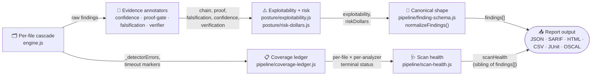

# Architecture: the finding lifecycle

A finding is not born with a severity and a confidence score already
attached — those are computed in stages, each one adding real fields on top
of what the last stage produced, and each stage's output is a genuine
prerequisite for the next (annotators that consume `parser`/`family`
no-op silently if those fields are still null, which is why
`backfillFindingDefaults` runs before `annotateConfidence`, not after).
This page traces that pipeline through the real module names in
`scanner/src/`, from the first detector call to the object that ships in
`agentic-security scan --format json`'s `findings[]` array.

---

## Per-file cascade — `engine.js`

Every file in scope runs through `_runFileCascade`, which calls each of the
121 registered detectors (110 unconditional, a handful gated by file
extension or an `AGENTIC_SECURITY_NO_*` operator policy). Every call site is
individually isolated — a detector that throws is captured into
`_detectorErrors` as `{file, analyzer, err}` rather than aborting the file,
and a file whose whole cascade is preemptively killed on deadline is marked
`_timeout:true` rather than silently reporting partial results as complete.
This is the only stage that produces *raw* findings; everything after it
enriches or judges what this stage already found, it never adds a new
detection.

## Evidence annotators — `posture/confidence.js`, `dataflow/proof-gate.js`, `posture/falsification.js`, `posture/verifier.js`

A sequence of annotators runs over the deduped, cross-file-merged finding
list, each adding one evidence field without touching `severity`:
`annotateConfidence` computes `confidence`/`confidenceTier`;
`annotateProofGate` (`dataflow/proof-gate.js`) sets `proof` — whether the
flow-proof gate could discharge the finding as clean or infeasible;
`annotateFalsification` (`posture/falsification.js`) actively tries to
*disprove* the finding, sets `falsification`, demotes confidence when it
finds a context-matched control on the path, and — in the same pass —
records its verdict through `posture/verification-separation.js`'s
producer/verdict API, which is what populates `verification.producer`,
`.verdicts[]`, and `.consensus`: the structural guarantee that the party
who found a finding cannot be the same party who clears it.
(`posture/verifier.js`'s `annotateVerifierVerdicts` is a separate,
unrelated pass — the optional live/sandboxed PoC-execution check; it sets
`verifier_verdict`/`verifier_reason`/`verifier_runner` and never touches
`verification.*`.) `chain[]` — the actual path evidence, one hop per
`{file, line, label, provenance}` — is set earlier, by the detector that
found the flow, not by an annotator in this stage. The full field-by-field
read of these is [Reading a finding's evidence](../walkthroughs/finding-evidence.md).

## Coverage ledger — `pipeline/coverage-ledger.js`

Running in parallel off the same per-file cascade, `computeCoverageLedger`
turns `_detectorErrors` and the timeout markers into a per-file ×
per-analyzer terminal status — `completed`, `failed`, `timed_out`, or
`skipped_by_policy` — so a coverage claim is computed from what actually
happened during the cascade, not asserted after the fact. A file whose
cascade was killed on deadline is marked as such for *every* analyzer that
would have run on it, because the preemptive kill has no per-analyzer
sub-deadline to report partial completion from.

## Exploitability + risk — `posture/exploitability.js`, `posture/risk-dollars.js`

`annotateExploitability` sets `exploitability`/`exploitabilityTier`/
`exploitabilityFactors[]` — a separate axis from confidence: not "how sure
are we this is real" but "how bad is it if it is," driven by factors like
severity and route-reachability. `annotateRiskDollars` runs after it and
sets `riskDollars`, a modeled expected-loss estimate (`ev`, `range`,
`scenarios`) built from the same exploitability/confidence fields plus
either genuine organization-specific inputs or, absent those, disclosed
industry base-rates (`scenarioStatus: "scenario_default"`).

## Scan health — `pipeline/scan-health.js`

`computeScanHealth`, followed by `applyFreshness`, rolls the coverage
ledger up into a single scan-level status — separating "no findings" from
"analysis complete" the way a single finding's fields never could. It
consumes the coverage ledger's summary alongside annotator errors, deep-mode
status, and lineage-graph status, plus feed-freshness signals (KEV, EPSS,
calibration, compliance). This is a property of the *scan*, not of any one
finding — see [Scan health](../walkthroughs/scan-health.md) for the full
status vocabulary.

## Canonical shape — `pipeline/finding-schema.js`, `normalizeFindings()`

`pipeline/finding-schema.js` names the field groups a finding is expected
to carry (`FINDING_SCHEMA_VERSION`), but the shape itself is not new
plumbing — it documents what `report/index.js`'s `normalizeFindings()`
already produces, and every JSON/SARIF/HTML/CSV/JUnit/OSCAL output format
calls that same function. This is a report-time projection, not a mid-scan
step: it runs once, per output request, over whatever fields the earlier
stages already attached, through an explicit field allowlist with an
honest `null` default for anything not populated.

## Report output

`findings[]` (via `normalizeFindings()`) and `scanHealth` (via
`pipeline/scan-health.js`) land in the same report object as siblings, not
one nested inside the other — a finding's evidence and the scan's own
completeness are two different questions, and this pipeline keeps them as
two different fields for exactly that reason.
