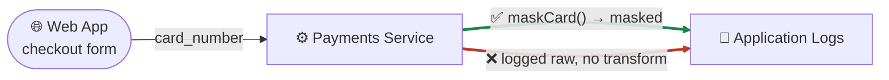
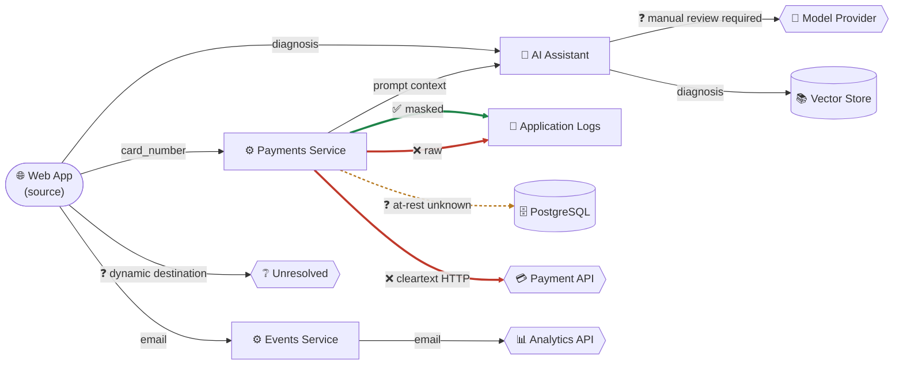

# Data Flow Explorer

**Goal:** see where sensitive data actually goes in your codebase — not just
"this line looks dangerous," but the real path from where a piece of data
enters your system to every place it ends up, with a protection verdict on
every hop.

**Prerequisites:** Node.js ≥ 24, and a local Chrome/Chromium install if you
want image exports (`png`/`pdf`/`svg`). Commands are shown as bare CLI
(`npx @clear-capabilities/agentic-security-scanner …`); in Claude Code the
same thing is `/agentic-security:dataflow …` (there is no `/explore` slash
command — see [Browse it in your browser](#browse-it-in-your-browser)
below for why). If `npx` reports `command not found` or you're tempted to
run this with plain `node`, see [Quickstart: Troubleshooting](quickstart.md#troubleshooting).

---

## What this answers that a regular scan doesn't

A normal `scan` tells you "this line has a SQL injection" or "this function
logs a secret." The Data Flow Explorer answers a different, architectural
question: **for a given piece of sensitive data — a credit card number, a
patient record, a password — where does it come from, everywhere it flows
to, and what protects it along the way?** That includes places a single-line
finding can't see: a field that's masked before one log call but raw before
another, a flow that crosses into an AI provider's API, a database write
with no encryption evidence, or an external call over plain HTTP.

It's built from the same scan you already run — nothing new to install, no
separate crawler.

---

## A worked example

Say a `card_number` field reaches `logger.info(...)` two different ways in
two different handlers — masked in one, raw in the other:

```js
// checkout-masked.js
function handleCheckout(req, logger) {
  const cardNumber = req.body.card_number;
  const maskedPan = maskCard(cardNumber);      // real transform on this path
  logger.info('processing payment', { pan: maskedPan });
}

// checkout-raw.js — same field, no transform on this path
function handleCheckout(req, logger) {
  const cardNumber = req.body.card_number;
  logger.info('processing payment', { pan: cardNumber });
}
```

(the same shape as this package's own AC-02 regression fixture pair,
`bench/data-lineage/fixtures/js-api-to-log-{masked,raw}/`.) A line-by-line
scanner sees one call, `logger.info(...)`, and has no way to say "this
field is safe on this path and unsafe on that one." The Data Flow Explorer
tracks the *field*, not the line, so both paths land on the same sink
node (the graph's nodes are categories like "Application Logs," not
individual call sites), but each path keeps its own edge and its own
verdict:



That's the whole idea in miniature: one **source** (where `card_number`
enters), one **sink** (where it ends up), and an edge per path with a real,
evidence-backed verdict — never a single "this call is dangerous" guess
averaged across both branches.

Zoom out from one field/one sink to a whole application and the same model
holds — every source, every sink, every hop between them, still graded
per-edge. This is the shipped reference topology (`payments-platform`, the
"flagship" fixture this package's own test suite is built against —
`scanner/src/lineage/fixtures/build-flagship-fixture.mjs`), reduced to its
data flows:



Reading it: **✅ green** is a real, evidenced protection (masking proven on
that path); **❌ red** is a real, evidenced gap (no TLS, no masking); **❓
amber/gray** is an honest "don't know" — no fabricated at-rest configuration
was found for PostgreSQL, and the AI/model-provider path is flagged for
manual review rather than silently marked either way. That honesty is the
point: a flow the scanner can't evidence never gets upgraded to "protected"
just because a sibling flow nearby is.

The four browser views described below are different lenses on this same
graph — the architecture view *is* this diagram (interactive, colored by
verdict); the trace/evidence view is what backs each ✅/❌/❓ when you click
an edge; the privacy lifecycle view groups the same nodes by data class
(PCI/PHI/PII) instead of by system; the inventory view lists every node
here, including `Unresolved Destination`, which nothing in this diagram's
prose even mentions reaching.

---

## Build the graph

```bash
AGENTIC_SECURITY_LINEAGE_DEEP=1 npx @clear-capabilities/agentic-security-scanner scan .
```

This is a normal scan with one extra environment variable. It writes a
signed `DataFlowGraph` artifact (`.agentic-security/lineage-graph.json`)
alongside your usual findings — every source (a request body, an env var, a
file read…), every sink (a log call, a database write, an external API
call…), and the field-level path between them, each edge carrying a real
transit/at-rest/handling protection verdict, never a guess. It's off by
default because building it costs real scan time; every command below
reads this artifact and never triggers a scan itself, so build it once,
then explore/export/diff as many times as you want.

---

## Browse it in your browser

```bash
npx @clear-capabilities/agentic-security-scanner explore .
```

```text
agentic-security explore: serving /Users/you/your-project
  URL: http://127.0.0.1:53214/#token=3f9a1c...(64 hex chars)
  Open this URL in a browser — the page authenticates itself automatically.
  Server auto-stops after a period of inactivity, or Ctrl-C to stop now.
```

Open that URL and you get four linked views: an **architecture** view (the
graph itself — sources, sinks, and the flows between them, colored by
protection status), a **privacy lifecycle** view (which data classes —
PII/PHI/PCI/financial — go where), a **trace/evidence** view (click any
flow to see the exact hops and what evidence backs each protection
verdict), and an **inventory** view (every source and sink, including ones
nothing currently reaches — a scanner that only shows connected findings
can't tell you about a sink it found but never proved reachable; this one
does).

**Why there's no `/explore` slash command:** this is a real local HTTP
server, so it's deliberately CLI-only rather than something a chat
turn spins up — you start it, use it in your browser for as long as you
want, and stop it yourself (`Ctrl-C`, or it auto-stops after a period of
inactivity unless you pass `--keep-open`). It's **read-only and
loopback-only** — it serves the graph you already built, never accepts a
write, and only ever binds to `127.0.0.1`, so nothing outside your own
machine can reach it. The session token in the URL is how the page
authenticates to the server; it lives in the URL *fragment*
(`#token=...`), which browsers never send in an HTTP request — so it can
never end up in a server access log — yet the page's own JavaScript can
still read it once and attach it to every API call it makes.

`--port <n>` picks a specific port instead of a random one (useful for
scripting); `--keep-open` disables the idle auto-stop.

---

## Export it

Everything the browser view shows, you can also get as a file — for a PR
comment, a compliance packet, a slide, or a CI artifact. One command,
several formats:

```bash
npx @clear-capabilities/agentic-security-scanner dataflow export . --format html --output report.html
```

| I want… | `--format` | Notes |
|---|---|---|
| A shareable, self-contained web page | `html` | Opens standalone in any browser — the same interactive views `explore` serves, no server needed. |
| A picture for a doc or slide | `png` | `--size 2x` for a hi-res version. Needs local Chrome. |
| A vector diagram | `svg` | Architecture view only. Needs local Chrome. |
| The raw graph, for your own tooling | `json` | Includes a tamper-evident digest. |
| One row per flow, for a spreadsheet | `csv` | |
| A DPIA (GDPR Art. 35) | `dpia` | Real flows, real protection verdicts — governance facts you haven't supplied are honestly marked `manual_required`, never guessed. |
| A RoPA (GDPR Art. 30 register) | `ropa` | One row per (flow × data class). |
| An executive risk narrative | `briefing` | `--audience board\|ciso\|privacy\|compliance\|regulator\|technical` changes the wording, never the underlying facts or ranking. |
| Who your data actually goes to | `recipients` | Third-party/cross-border recipient facts — code-inferred vs. operator-declared vs. genuinely unknown, each labeled as such. |
| How well each language is covered | `coverage` | Per-language file counts and a disclosed, dated recall estimate — never presented as the same kind of number. |

Every export is redacted by default (`--no-redact` to opt out, where the
format supports it) and can be scoped with `--filter <path.json>` to just
the part of the graph you care about. Full flag reference, every format's
exact support matrix, and worked examples: `/agentic-security:dataflow` →
[`commands/dataflow.md`](../../commands/dataflow.md).

---

## Beyond a snapshot: comparison, simulation, and blast radius

The graph isn't just a point-in-time picture. Once you've scanned more than
once, or want to reason about a change before making it:

- **`dataflow diff`** — compare two scans (by default, the two most recent)
  and see exactly what changed: a new flow, a field that lost its
  protection, a newly-introduced path into an AI provider. Pair it with
  `--drift-policy` to fail CI when a specific rule is violated (e.g. "PHI
  must never reach an AI provider without explicit handling").
- **`dataflow scenario apply`** — simulate a hypothetical fix ("what if we
  added TLS here?") against the real graph without touching your actual
  scan. Every simulated verdict is labeled `HYPOTHETICAL` with `assumed`
  evidence, so it can never be mistaken for something you've actually
  verified — and the real graph on disk is never modified.
- **`dataflow impact assess`** — given a compromised node, edge, flow, or
  data element, see everything reachable from it: which other flows,
  which recipients, which regulatory obligations are affected.
- **`dataflow observations import`** — layer real runtime telemetry (from
  your own observability stack) onto the static graph, so a flow the
  static analysis found gets marked `RUNTIME OBSERVED` when traffic
  actually confirms it — metadata-only, never a captured payload.
- **`federate declare`** — link a node in this repo's graph to a node in
  another, separately-scanned repo's graph, for tracing data flow across
  service boundaries. Each repo's graph stays its own separate artifact —
  never merged.

---

## Acting on what you find

Two more commands turn a finding in the graph into tracked, verifiable
work:

- **`governance propose-edit`** — declare or correct a recipient/governance
  fact (who a third party is, their processor role, jurisdiction…) through
  a reviewable preview → confirm → audit-logged write, never a silent
  hand-edit.
- **`remediation open`** — open a tracked remediation item against a real
  blast-radius assessment, with due dates and required evidence. Marking
  it "done" doesn't close it — only a clean rescan or an explicitly
  permitted manual attestation does, and a later regression reopens it
  automatically.

---

## Where to go deeper

- Full CLI reference for every command above: [`commands/dataflow.md`](../../commands/dataflow.md), [`commands/governance.md`](../../commands/governance.md), [`commands/remediation.md`](../../commands/remediation.md), [`commands/federate.md`](../../commands/federate.md).
- Environment variables (`AGENTIC_SECURITY_LINEAGE_DEEP` and friends): [Configuration reference](../reference/configuration.md).
- What's modeled, what isn't, and the coverage-tier disclosure for languages that aren't fully supported yet: `dataflow export --format coverage`.
