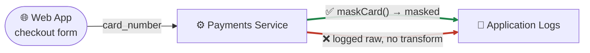

# Walkthrough: watch one field's journey

**Goal:** follow a single sensitive field — `card_number` — from the moment
it enters your application to every place it ends up, and see how the Data
Flow Explorer tells "masked before this sink" apart from "raw before that
one," even though both paths pass through the same code.

This is a narrow, worked-example companion to the full guide — read
**[Data Flow Explorer](../guides/data-flow-explorer.md)** first for what the
graph is, how to build it, how to browse it, and every export format. This
page doesn't repeat any of that. It picks up exactly where that guide's own
"A worked example" section leaves off and slows down on one thing: what it
actually means, field by field, to watch one piece of data move.

---

## Why "one field" is the right unit, not "one line"

A regular SAST finding is anchored to a line: `report.py:16`, `app.js:8`.
That's the right unit for "this call is dangerous." It is the wrong unit for
a privacy question, because the same field can reach the same kind of sink
two different ways in two different handlers — and a line-scoped finding
has no vocabulary for "safe here, unsafe there." The Data Flow Explorer
tracks the *field*, not the call site, specifically to answer that question.

---

## The example, reused verbatim from the main guide

Two handlers, same field, two outcomes:

```js
// checkout-masked.js
function handleCheckout(req, logger) {
  const cardNumber = req.body.card_number;
  const maskedPan = maskCard(cardNumber);      // real transform on this path
  logger.info('processing payment', { pan: maskedPan });
}

// checkout-raw.js — same field, no transform on this path
function handleCheckout(req, logger) {
  const cardNumber = req.body.card_number;
  logger.info('processing payment', { pan: cardNumber });
}
```

(the same shape as this package's own AC-02 regression fixture pair,
`bench/data-lineage/fixtures/js-api-to-log-{masked,raw}/`.) Both handlers
call `logger.info(...)`. A line-by-line scanner sees two calls to the same
function and has no way to say one is fine and the other isn't. The graph
sees one **source** (`card_number` entering at the checkout form), one
**sink category** (`Application Logs` — the graph's sinks are categories,
not individual call sites, so both handlers' log calls land on the same
node), and two **edges** between them, each carrying its own real,
evidence-backed verdict:



---

## Reading the journey, hop by hop

- **Source: the checkout form.** `card_number` enters the system as a
  request-body field. The Data Flow Explorer's source/sink registries
  classify it by field NAME at this point of entry — `card_number` matches
  the PCI class's own field-name patterns
  (`scanner/src/dataflow/privacy-taxonomy.js`'s `PCI` entry, which the
  lineage package reuses rather than re-deriving) — so from the very first
  hop, this field is already tagged as regulated payment data, not
  generic text.

- **Hop 1: into the Payments Service.** The field moves from the web
  app node into the service that owns checkout logic. Nothing has
  transformed it yet — it's still the raw card number at this point,
  which is exactly what you'd want the graph to say, because it's true.

- **The fork: `maskCard()` vs. nothing.** This is the one moment that
  makes the two handlers different, and it's a real, catalogued
  transformation, not a guess. A call recognized as a masking
  transform (the same shape `maskCard`/similarly-named calls take across
  this package's transform catalog) changes the edge's evidence from
  "raw" to "masked" — one specific function call is the entire reason one
  arrow is green and the other is red.

- **Sink: Application Logs.** Both paths converge on the same sink
  category, and that convergence is the point: if the graph collapsed
  the masked and raw paths into one averaged verdict for "does
  `card_number` reach the logs safely," the answer would have to be
  either an overly-alarming "no" (ignoring the real control on the
  masked path) or a falsely-reassuring "yes" (ignoring the raw path
  entirely). Keeping the edges separate is what lets both truths stand
  at once.

- **What "✅" and "❌" actually certify.** Green means a real, evidenced
  protection was found on *that* edge — here, the `maskCard()` call
  sitting directly between the source and the sink. Red means the
  opposite was found: the field reaches the sink with no such call on
  its path. Neither color is a guess averaged from a sibling edge, and
  neither is upgraded just because the other edge nearby looks fine.

---

## Where this fits in the fuller graph

`card_number` is one field in one flow. A real application has many —
`email` into an events pipeline, a `diagnosis` field into an AI assistant,
a payment going out to a card processor over plain HTTP. The main guide's
own flagship-fixture diagram shows all of it at once, colored the same
way: green for evidenced protection, red for an evidenced gap, amber/gray
for an honest "don't know." Open it in your browser — `agentic-security
explore .` gives you an interactive **architecture** view (this diagram,
clickable) plus a **privacy lifecycle** view that regroups the exact same
nodes by data class instead of by system, so you can ask "everywhere PCI
data goes" as directly as "everywhere the Payments Service talks to."

A captured screenshot of that fuller architecture view lives at
`docs/assets/dataflow-architecture-view.png`, and the click-through
trace/evidence view — the screen that shows you exactly what backed the
✅ on the masked edge above — lives at `docs/assets/dataflow-trace-view.png`.

---

## Try It Yourself

Pick one sensitive field in your own codebase — an email address, an SSN,
a diagnosis code, anything your app collects — and build the graph:

```bash
AGENTIC_SECURITY_LINEAGE_DEEP=1 npx @clear-capabilities/agentic-security-scanner scan .
npx @clear-capabilities/agentic-security-scanner explore .
```

Open the URL it prints, switch to the privacy lifecycle view, and find your
field's data class. Click through to every sink it reaches. Before you
look at the verdict colors, guess: which paths do you expect to be
protected, and which do you expect the graph to catch you off guard on?
Then check — the whole value of tracking the field instead of the line is
that a "obviously fine" call site and a "obviously the same code" call
site two files over can carry different verdicts, and only the graph
will tell you which is which.

---

## Go Deeper

- [Data Flow Explorer](../guides/data-flow-explorer.md) — the full guide
  this page is a companion to: building the graph, every browser view,
  every export format (including a DPIA/RoPA straight from real flows),
  diff/simulate/impact-assess, and the CLI reference.
- [`commands/dataflow.md`](../../commands/dataflow.md) — full flag
  reference for every command mentioned above.
- [Architecture](../ARCHITECTURE.md) — where the Data Flow Explorer's
  `DataFlowGraph v1` contract sits relative to the rest of the scan
  pipeline.
